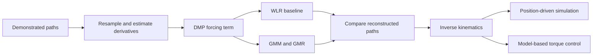

# Learning Robot Motion from Demonstration

[English](README.md) | [简体中文](README_zh-CN.md)

**Turn example handwriting motions into a reusable trajectory, then make a simulated two-link arm follow it using position-driven and torque-driven models.**

[Read the MATLAB Live Script report](Written_report_template.mlx) · [Trajectory learning code](SkillGeneralisation.m) · [Torque-control model](RobotSimulation_Task4.slx)

**Focus:** Learning from demonstration · Trajectory generation · Probabilistic modelling · Robot control

**Stack:** MATLAB · Simulink · Simscape Multibody · DMP · GMM/GMR

## Project overview

Programming every point of a robot motion by hand is inflexible. This project learns a motion pattern from demonstrations and connects the learned trajectory to a two-link manipulator simulation.

The workflow compares a conventional Dynamic Movement Primitive (DMP) fitted with locally weighted linear regression against a DMP whose nonlinear forcing term is learned using a Gaussian mixture model and Gaussian mixture regression (GMM-GMR). The selected trajectory is then used for kinematic reproduction and model-based torque tracking.

## Recorded outcome

The report compares reconstruction against **five demonstrations**, resampled to **200 points each**, using **25 basis functions / mixture components** in the presented setup.

| Reconstruction metric | DMP with WLR | DMP with GMM-GMR |
|---|---:|---:|
| Mean Euclidean error | 1.5150 | **1.4094** |
| RMSE | 1.9026 | **1.8346** |
| Maximum error | 4.9118 | **4.5478** |
| Error standard deviation | **1.1515** | 1.1750 |

The recorded GMM-GMR result reduces mean error by about **6.97%** and RMSE by **3.57%**. It does not improve every measure: error variability is slightly higher. Values are in the demonstration data's coordinate units, as reported in the [Live Script](Written_report_template.mlx); they are reconstruction metrics, not physical robot accuracy or unseen-task success rates.

The report then transfers the selected G-shaped path into position-driven and torque-driven arm simulations. It discusses controller gains, torque limits and a 120-second execution duration as a balance between tracking and aggressive motion.

## What was implemented

| Stage | Technical work |
|---|---|
| Prepare demonstrations | Resample Cartesian paths and estimate velocity and acceleration |
| Represent the skill | Use the DMP phase system and spring-damper dynamics to separate the motion shape from its attracting dynamics |
| Fit a baseline | Locally weighted linear regression of the nonlinear forcing term |
| Learn a probabilistic model | GMM fitting with expectation-maximisation, followed by conditional GMR prediction |
| Compare trajectories | Mean error, RMSE, maximum error, variability and trajectory plots |
| Connect learning to control | Inverse kinematics, position-driven simulation and model-based PD torque control |

The implementation builds on coursework scaffolding and supplied demonstrations. The completed learning methods, evaluation and controller integration are visible in the classes, Live Script and Simulink models.

## From demonstration to control



**Position-driven simulation** checks the geometric transfer from Cartesian motion to joint angles. **Torque-driven simulation** adds the dynamics and feedback needed to follow the reference through joint torques. Keeping these stages separate makes it possible to distinguish trajectory-generation behaviour from controller behaviour.

## Skills demonstrated

- Implement statistical learning methods and compare them with a simpler baseline.
- Convert demonstrations into time-dependent motion references.
- Connect Cartesian trajectories, inverse kinematics and joint-space control.
- Evaluate performance with multiple metrics and discuss the cost of controller tuning.

## Repository guide

| File | Purpose |
|---|---|
| [`Written_report_template.mlx`](Written_report_template.mlx) | Completed Live Script containing the workflow, code, plots and analysis; the original template filename is retained |
| [`SkillGeneralisation.m`](SkillGeneralisation.m) | DMP preprocessing, WLR/GMR fitting and trajectory reconstruction |
| [`MixtureGaussians.m`](MixtureGaussians.m) | GMM, EM learning and GMR implementation |
| [`Demonstrations.mat`](Demonstrations.mat) | Input demonstration trajectories |
| [`LearnedTrajectory.mat`](LearnedTrajectory.mat) | Saved learned trajectory |
| [`SimData.mat`](SimData.mat) | Prepared simulation reference data |
| [`RobotSimulation.slx`](RobotSimulation.slx) | Position-driven kinematic model |
| [`RobotSimulation_Task4.slx`](RobotSimulation_Task4.slx) | Torque-driven model and controller |

## Open and reproduce

Use **MATLAB**, **Simulink**, **Simscape / Simscape Multibody**, and **Statistics and Machine Learning Toolbox** for functions such as `mvnpdf`. The Simulink models were saved in **R2025b**.

1. Download or clone the repository and set it as the MATLAB current folder.
2. Open the Live Script:

```matlab
open('Written_report_template.mlx');
```

3. Run the learning and comparison sections in order. They load the demonstrations, fit both methods and prepare the learned trajectory.
4. Run the simulation-data preparation section before opening the kinematic model:

```matlab
open_system('RobotSimulation.slx');
```

5. Follow the report's Task 4 setup, including reference data and initial joint configuration, before running:

```matlab
open_system('RobotSimulation_Task4.slx');
```

The models depend on the workspace prepared by the report; opening a model alone is not a complete reproduction procedure. Saved `.mat` files are included for inspection, and rerunning preparation sections can replace them.

## Evidence and scope

This is a **simulation-based learning and control project**. The results above are recorded report values, not a new training run. Reconstruction is assessed against the supplied demonstrations; broader generalisation and hardware performance would require additional experiments. The README does not treat prescribed position motion as proof of torque-control accuracy.
