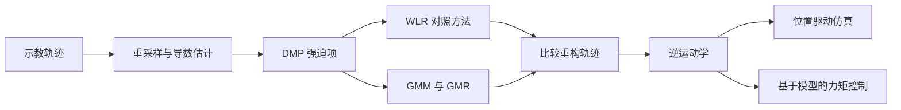

# 从示教轨迹到机械臂运动控制

[English](README.md) | [简体中文](README_zh-CN.md)

**从手写轨迹示例中学习运动模式，再让仿真双连杆机械臂通过位置驱动和力矩驱动两种方式复现轨迹。**

[查看 MATLAB Live Script 报告](Written_report_template.mlx) · [轨迹学习代码](SkillGeneralisation.m) · [力矩控制模型](RobotSimulation_Task4.slx)

**项目方向：** 示教学习、轨迹生成、概率建模、机器人控制

**技术栈：** MATLAB、Simulink、Simscape Multibody、DMP、GMM/GMR

## 项目概览

逐点编写机器人运动轨迹缺乏灵活性。本项目通过多条示教轨迹学习运动模式，并将学习结果接入双连杆机械臂仿真。

项目比较了两种动态运动基元（DMP）方法：使用局部加权线性回归拟合非线性强迫项的传统方法，以及使用高斯混合模型与高斯混合回归（GMM-GMR）学习强迫项的方法。选择轨迹后，进一步进行运动学复现和基于模型的力矩跟踪控制。

## 已记录的结果

报告中的对比使用 **五条示教轨迹**，每条重采样为 **200 个点**，展示的设置包含 **25 个基函数 / 混合分量**。

| 重构指标 | DMP + WLR | DMP + GMM-GMR |
|---|---:|---:|
| 平均欧氏误差 | 1.5150 | **1.4094** |
| 均方根误差（RMSE） | 1.9026 | **1.8346** |
| 最大误差 | 4.9118 | **4.5478** |
| 误差标准差 | **1.1515** | 1.1750 |

记录中，GMM-GMR 的平均误差降低约 **6.97%**，RMSE 降低约 **3.57%**，但误差标准差略有增加，因此并非所有指标都改善。数值采用[报告](Written_report_template.mlx)中示教数据的坐标单位，表示轨迹重构误差，不是实物机器人的定位精度或未知任务成功率。

报告随后将所选 G 形轨迹接入位置驱动与力矩驱动仿真，并讨论控制增益、力矩限制及 120 秒执行时长，在跟踪效果与剧烈运动之间进行取舍。

## 核心实现

| 阶段 | 技术工作 |
|---|---|
| 处理示教数据 | 对笛卡尔轨迹重采样，并估计速度和加速度 |
| 表达运动技能 | 使用 DMP 相位系统与弹簧阻尼动力学，将运动形状与吸引动力学分离 |
| 构建对照方法 | 用局部加权线性回归拟合非线性强迫项 |
| 概率学习 | 通过 EM 训练 GMM，再使用 GMR 进行条件回归 |
| 比较轨迹 | 分析平均误差、RMSE、最大误差、波动与轨迹图 |
| 接入机器人控制 | 实现逆运动学、位置驱动仿真及基于模型的 PD 力矩控制 |

项目基于课程提供的代码框架与示教数据开展，已完成的学习方法、评估及控制集成可在类文件、Live Script 和 Simulink 模型中查看。

## 从示教到控制的流程



**位置驱动仿真**检查笛卡尔路径到关节角度的几何转换；**力矩驱动仿真**进一步加入动力学与反馈，通过关节力矩跟踪参考轨迹。将两者分开，可以区分轨迹生成效果与控制器表现。

## 项目体现的能力

- 实现统计学习方法，并与简单基线进行定量比较。
- 将示教数据转化为随时间变化的运动参考。
- 打通笛卡尔轨迹、逆运动学与关节空间控制。
- 通过多指标评价分析效果，并讨论控制参数调整的代价。

## 仓库导览

| 文件 | 功能 |
|---|---|
| [`Written_report_template.mlx`](Written_report_template.mlx) | 包含流程、代码、图表与分析的已完成 Live Script，保留原模板文件名 |
| [`SkillGeneralisation.m`](SkillGeneralisation.m) | DMP 预处理、WLR/GMR 拟合与轨迹重构 |
| [`MixtureGaussians.m`](MixtureGaussians.m) | GMM、EM 学习与 GMR 实现 |
| [`Demonstrations.mat`](Demonstrations.mat) | 输入示教轨迹 |
| [`LearnedTrajectory.mat`](LearnedTrajectory.mat) | 保存的学习轨迹 |
| [`SimData.mat`](SimData.mat) | 整理后的仿真参考数据 |
| [`RobotSimulation.slx`](RobotSimulation.slx) | 位置驱动运动学模型 |
| [`RobotSimulation_Task4.slx`](RobotSimulation_Task4.slx) | 力矩驱动模型与控制器 |

## 打开与复现

需要 **MATLAB、Simulink、Simscape / Simscape Multibody**，以及提供 `mvnpdf` 等函数的 **Statistics and Machine Learning Toolbox**。Simulink 模型保存于 **R2025b**。

1. 下载或克隆仓库，将 MATLAB 当前目录设为仓库目录。
2. 打开 Live Script：

```matlab
open('Written_report_template.mlx');
```

3. 按顺序运行学习与对比部分，加载示教数据、拟合两种方法并准备学习轨迹。
4. 执行仿真数据准备部分，再打开运动学模型：

```matlab
open_system('RobotSimulation.slx');
```

5. 按报告 Task 4 完成参考数据、初始关节状态等设置，再打开并运行：

```matlab
open_system('RobotSimulation_Task4.slx');
```

模型依赖报告准备的工作区变量，因此仅打开模型不等于完成复现。仓库附带 `.mat` 文件供查看，重新执行数据准备部分可能覆盖这些文件。

## 验证范围

本项目属于**仿真示教学习与控制研究**。上述指标来自已保存的报告，不是本次重新训练的结果。轨迹重构是在所提供示教数据上评价的，更广泛的泛化能力与实机效果仍需要额外实验；位置驱动下复现参考运动也不能直接作为力矩控制精度的证明。
